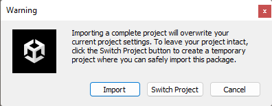

Back to [Samples](../samples.md)

# Samples - How to Install

Here are the steps required in order to install the Rival Samples project:

**WARNING: this will completely overwrite the project settings and dependencies. Make sure you do this in a new empty project!**

* Create a completely new Unity project, using the “3D” template. You can call this project “RivalSamples” for example. The starting template we choose here does not matter much, because all of the project settings will be overwritten by the "RivalSamples" unitypackage later.

* Import the Rival package into this project (not the "RivalSamples" package; just the regular Rival package from the store).
* A popup will appear saying this package has dependencies: click "Install/Upgrade"

* Wait for the importing/compilation to finish 
* A popup will let you import the Rival files. Make sure all files are selected, and click "Import"

* Wait for the importing/compilation to finish 
* In “Edit > Project Settings > Player”, set the “Active Input Handling” to “Both”. 

* Depending on your Unity version, a popup may appear saying the editor must be restarted. If you get the popup, click "Apply" to restart. If you don't get the popup, it is advised to restart Unity anyway just to be sure (it is important to restart now before going any further)

* After the restart, go to the “Assets/Rival/Samples” folder, and open “RivalSamples.unitypackage” by double-clicking on it inside Unity's "Project" window. 
* A popup will appear saying this package will overwrite all project settings: click "Import"

* A popup will appear saying this package has dependencies: click "Install/Upgrade"

* A popup will let you import the RivalSamples files. Make sure all files are selected, and click "Import"

* Wait for the importing/compilation to finish 
* **[IMPORTANT]** At this point, restart Unity before opening any scenes. If you skipped this step, see “NOTE 2” at the bottom of the page
* Once restarted, in the top bar menu: Make sure that "Jobs > Burst > Enable Compilation" is enabled, "Jobs > JobsDebugger" is disabled, and "Jobs > Leak Detection" is **not** set to "Full Stack Traces". Not doing so will have a significant performance impact when playing in editor
* Now you're done! You can find all samples under the “Rival_Samples” folder!

------------------------------ 

NOTE 1: If after these steps, you still don’t see the “Rival_Samples” folder in your project, simply restart Unity again and try to reopen the “RivalSamples.unitypackage” again. This is most likely due to the import process being blocked or interrupted by other import/compilation processes.

NOTE 2: If you are seeing anything that isn't working properly after importing the Samples (invalid shaders, subscenes not loading, etc...), try exiting Unity, and deleting the "Library" folder (the one next to your project's "Assets" folder). This will cause Unity to cleanly reimport everything the next time you open the project, and it often solves these issues.

NOTE 3: "RivalSamples.unitypackage" does not actually include the core Rival files. If you install the samples in a different way than what is described here, you must keep this in mind, and import "Rival" on top of the samples package.